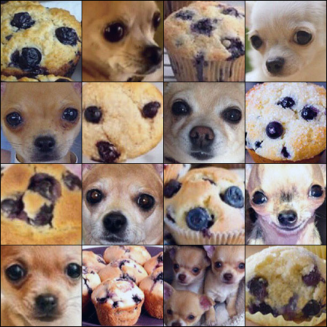
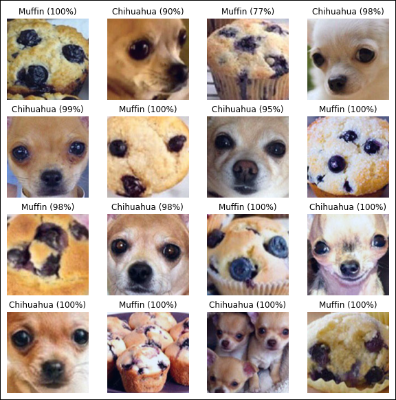

# Chihuahua or muffin ?

Some years ago, the following picture went viral.

It presents 8 photos of chihuahuas and 8 photos of muffin that look similar at first glance.

As this classification task seemed overwhelmingly difficult for the human brain, I decided to use science to help me to tell them apart.

After collecting a bunch a pictures of muffins and chihuahuas, I used transfer learning on a ResNet-18 neural network to train a classifier.

Thanks to data science, it is now possible to know which of these photos are chihuahuas, and which one are muffins.

